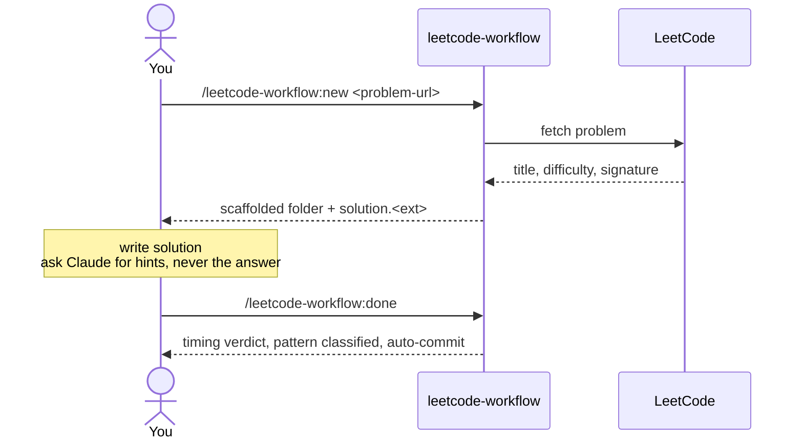
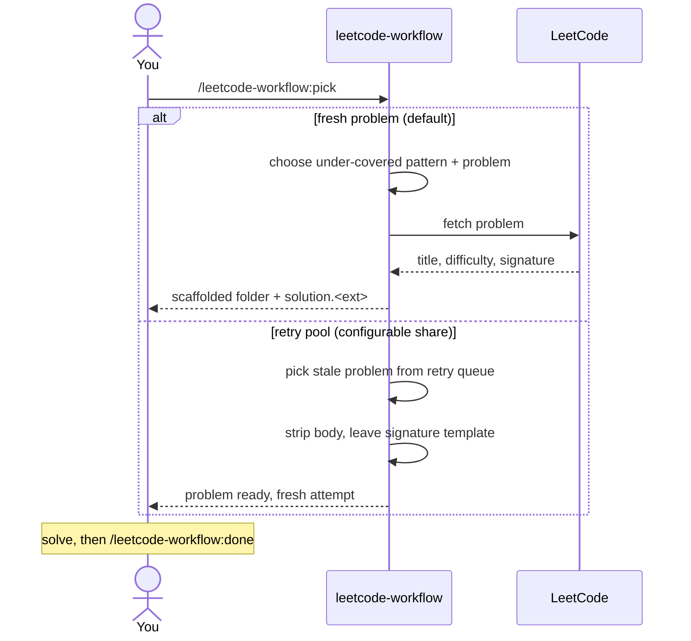
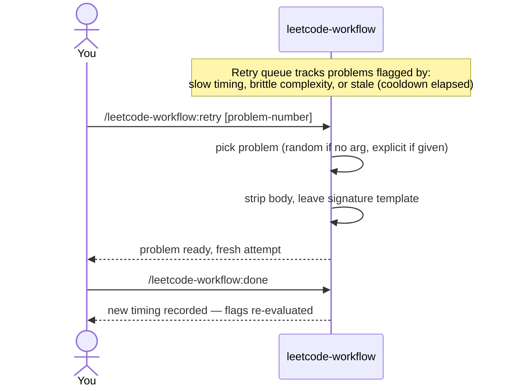

# leetcode-workflow

A Claude Code-native LeetCode practice workflow. Scaffolds problems from a URL, classifies patterns automatically, tracks per-attempt solve times against configurable thresholds, and maintains a retry queue with spaced-repetition cooldown — all backed by a local SQLite database with five generated Markdown views.

This repository is a **Claude Code plugin marketplace**. Install the plugins here and they ship a set of slash commands you run inside your own LeetCode practice repo.

> **Status: pre-release v0.1.0.** API and schema may still change as the plugin gets exercised against real practice.

---

## What's in the box

Seven slash commands, each backed by deterministic Python scripts; orchestration prose lives in `commands/<name>.md`.

| Command | Purpose |
|---|---|
| `/leetcode-workflow:init` | Bootstrap a fresh practice repo at the current directory: schema, empty views, default config, `.gitignore`, initial commit. Asks two short questions (language, retry thresholds) — `ok` accepts defaults. |
| `/leetcode-workflow:new <problem-url>` | Scaffold a problem from a LeetCode URL (e.g. `https://leetcode.com/problems/two-sum/`). Creates the folder, writes the README, seeds `solution.<ext>` with LC's per-language signature template, opens an attempt. |
| `/leetcode-workflow:pick` | "What should I solve next?" — picks a fresh problem targeting an under-covered pattern. With non-zero `pick_retry_ratio`, occasionally routes to a retry pick instead. |
| `/leetcode-workflow:done` | Close out the current attempt: timing verdict against your threshold, pattern classification, complexity flag, auto-commit. |
| `/leetcode-workflow:retry [problem-number]` | Pick a problem to revisit. No argument — random from the cooldown-elapsed retry pool. With an argument (e.g. `1`, `42`) — explicit revisit by problem number, cooldown bypassed. Strips the previous body to a signature template. |
| `/leetcode-workflow:abort` | Drop the latest in-progress attempt, restore the solution file from `HEAD`. |
| `/leetcode-workflow:update` | Apply pending DB migrations after a plugin update; dismisses the update nudge. |

---

## Install (once published)

```bash
# In Claude Code:
/plugin marketplace add lazyexpert/leetcode-workflow
/plugin install leetcode-workflow@leetcode-workflow
```

Then in any directory:

```bash
mkdir my-lc-practice && cd my-lc-practice
# In Claude Code:
/leetcode-workflow:init
```

You're ready to solve.

---

## Why

Most LeetCode practice setups are scratch directories with a copy-pasted problem statement and a one-shot solution file. After 50 problems you've lost track of which patterns you've covered, which were slow, and which deserve a second pass. This workflow encodes that bookkeeping as durable state — your DB tracks every attempt, the retry queue surfaces what's worth revisiting, and the Markdown views give you a human-readable progress log without manual upkeep.

The pedagogical contract is enforced: Claude is configured as a coach, not a solution generator. You get hints, complexity analysis, pattern names — never the answer.

---

## Workflow

Three flows you'll spend most of your time in.

### Daily flow — solving a new problem

`/new` takes a LeetCode problem URL like `https://leetcode.com/problems/two-sum/`.



### Picking what's next

`/pick` is one-shot: it chooses a problem and gets you ready to solve. Default routing targets an under-covered pattern (and scaffolds it for you, like `/new` would); at your configured `pick_retry_ratio`, a share of invocations route to the retry pool instead.



### Spaced repetition — `/retry`

Past attempts that ran slow, used a brittle approach, or have aged past their cooldown surface in the retry queue. `/retry` reseeds one of them. Two forms: bare `/retry` picks at random from the cooldown-elapsed pool; `/retry <problem-number>` (e.g. `/retry 42`) revisits a specific problem and bypasses the cooldown.



---

## Contributing

Bug reports, feature requests, and PRs welcome. See [CONTRIBUTING.md](CONTRIBUTING.md) for setup, testing, and PR flow. If you're a coding agent, also read [AGENTS.md](AGENTS.md) — the agent-specific rules.

The architectural reference is [CLAUDE.md](CLAUDE.md). Worth a skim before filing an issue or proposing a feature.

---

## License

[MIT](LICENSE) © 2026 Khatskalev Oleksandr
